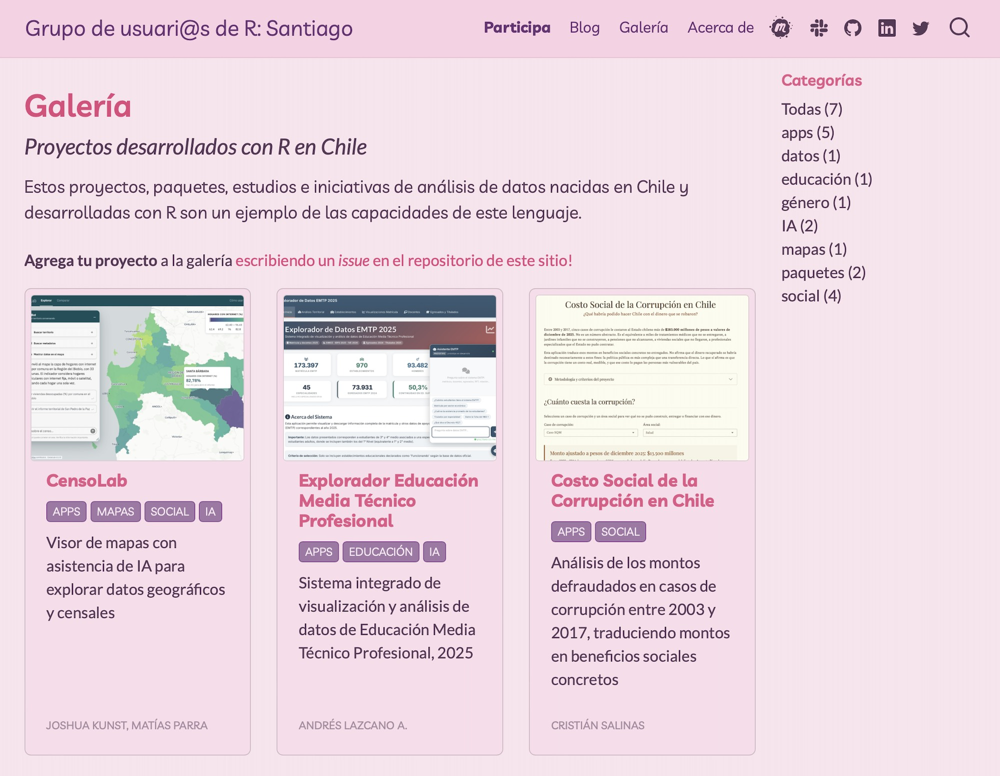

Agregamos una nueva sección a nuestro sitio web! Creamos una [galería](https://santiagorusers.github.io/galeria.html) de proyectos, paquetes y estudios hechos con el lenguaje R en Chile. 

El objetivo es poder reunir iniciativas en un sólo lugar, y ayudar a su difusión.

:::: {.galeria}
::: {style="max-width:400px;"}
{style="border: solid 1px #CFB6C0; border-radius: 7px;"}
:::
::::

Si quieres agregar tu propio proyecto, puedes [crear un nuevo _issue_ en GitHub](https://github.com/SantiagoRusers/santiagoRusers.github.io/issues/new?template=agregar-proyecto-a-galería.md) siguiendo las instrucciones de la plantilla. Posteriormente, un voluntario/a del grupo de usuarios intentará agregar tu proyecto a la brevedad.

:::{.boton}
<a href = "https://santiagorusers.github.io/galeria.html" 
target = "_blank">
 Visita la galería
</a>
:::
