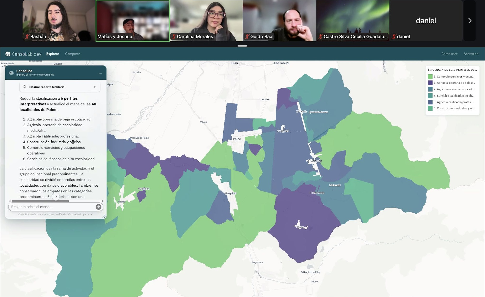
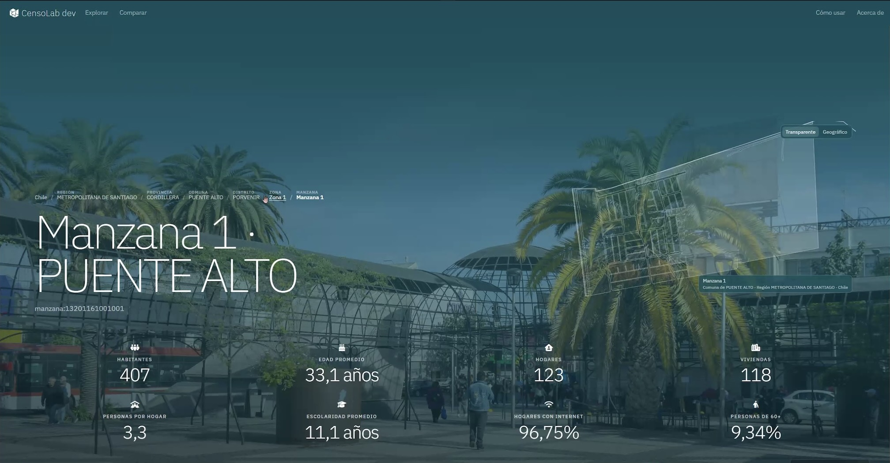
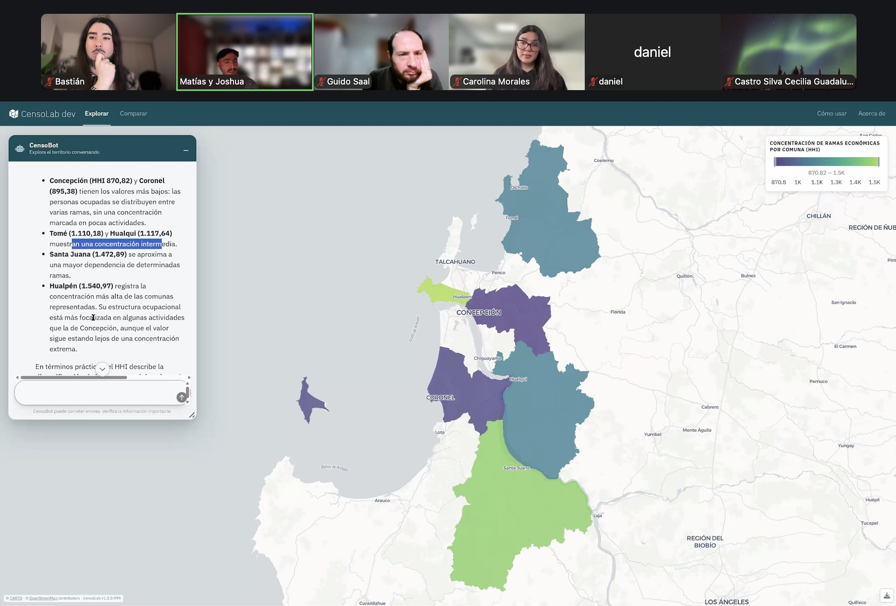
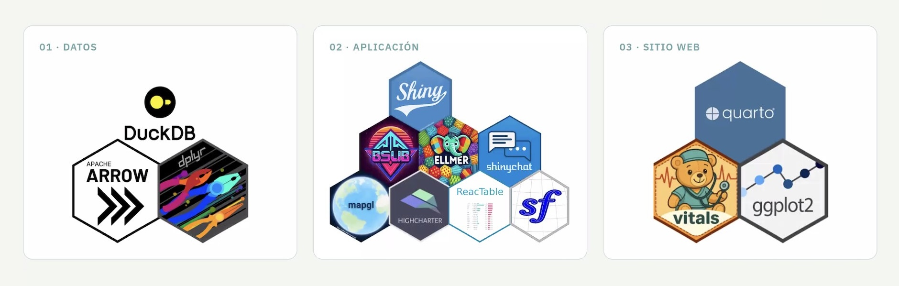
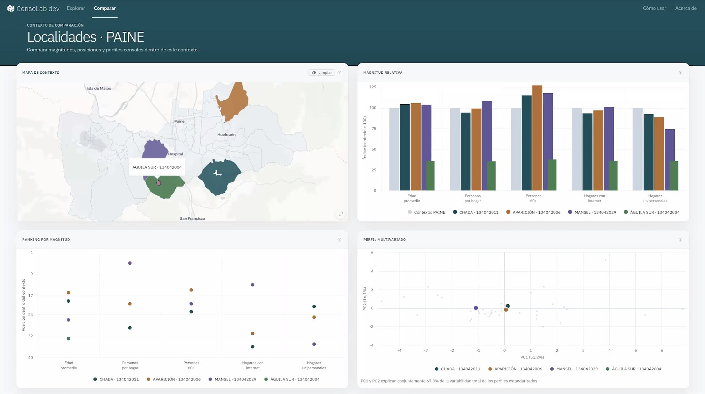
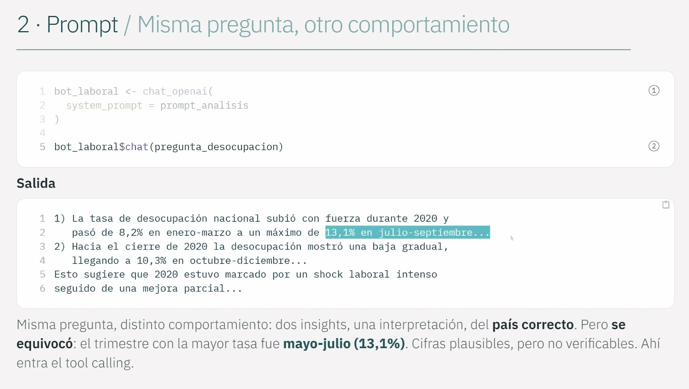
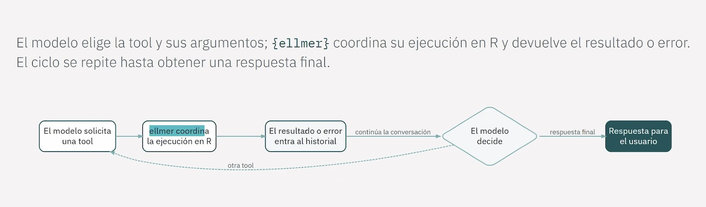
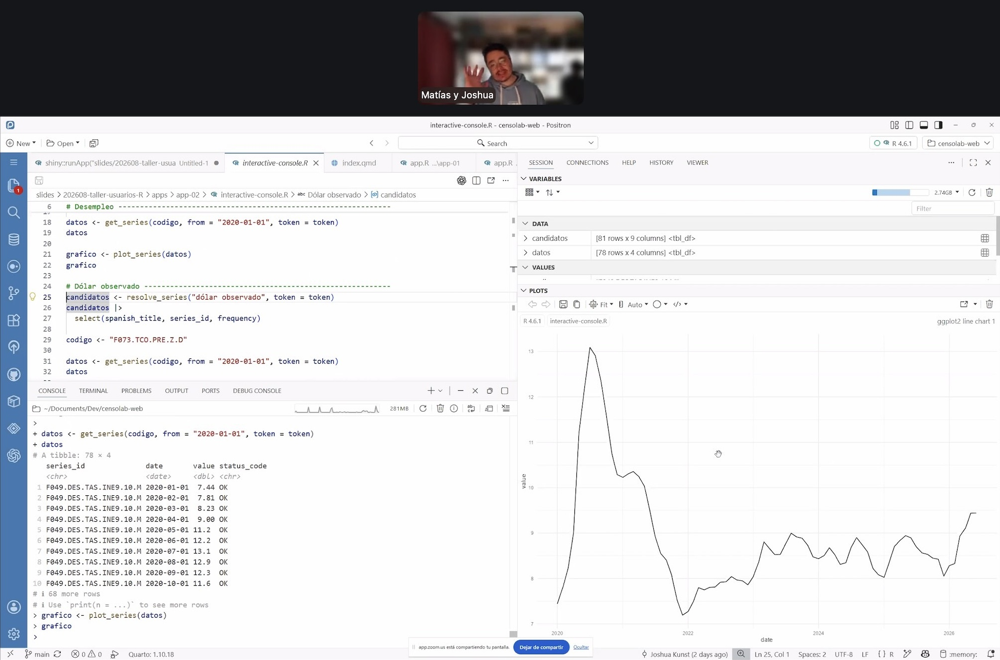

En la reunión mensual de agosto, [Joshua Kunst](https://www.linkedin.com/in/joshuakunst/) y [Matías Parra](https://www.linkedin.com/in/matias-parra-rojas) presentaron **[CensoLab](http://censolab.cl)**, una plataforma abierta para explorar datos geográficos y censales de Chile mediante mapas interactivos, dashboards y un asistente de IA conversacional. Además, impartieron un **taller práctico** sobre cómo construir agentes de IA en R con `{ellmer}` e integrarlos en aplicaciones `{shiny}`. 



> Muchas gracias a las **70 personas** que se conectaron a la presentación!

## Plataforma CensoLab

Acceder a información del Censo suele significar elegir entre dos extremos: **productos** simples de usar pero limitados, como tablas o dashboards oficiales, o bien acceder a los **microdatos**, que son flexibles pero exigen conocimientos técnicos de R, Python, SQL o GIS. CensoLab busca ocupar ese espacio intermedio: conservar la granularidad del microdato, integrar distintas herramientas en un mismo entorno, y ofrecer capacidades de visualización y análisis para la exploración siga el hilo de las preguntas.



En la demostración se mostraron casos como el **envejecimiento poblacional** por comuna, la **construcción de tipologías territoriales** combinando rama de actividad económica, ocupación y escolaridad (revelando fenómenos como la gentrificación rural en zonas agrícolas), la **comparación entre territorios**, y el cálculo de **índices de concentración económica** (Herfindahl) por comuna. Todo esto se puede pedir en lenguaje natural al asistente conversacional integrado, sin dejar de tener el mapa y las tablas como respaldo verificable.



### Arquitectura

CensoLab separa su desarrollo en tres repositorios independientes:

```{mermaid}
flowchart LR
    A["censolab-data<br/>DuckDB / MotherDuck"] --> B["censolab<br/>Shiny + CensoBot (ellmer)"]
    B --> C["censolab-web<br/>Quarto + GitHub Pages"]
```

El componente de **datos** descarga, limpia e integra el Censo 2024, la cartografía censal y datos de establecimientos de educación y salud, con las fuentes y opciones del pipeline definidas en un YAML versionado. El resultado se almacena en **DuckDB**, una base de datos analítica, orientada a columnas, sin servidor y con soporte geoespacial nativo, que puede publicarse en MotherDuck para consultarse de forma remota. Es una elección que refleja bien el espíritu de la comunidad R/open source: sin licencias, con un ecosistema de paquetes (`{duckdb}`, `{duckplyr}`) que permite trabajar con datos que no caben cómodamente en memoria sin salir de R.

La **aplicación** es un Shiny que combina un explorador centrado en el mapa, un perfil territorial (inspirado en DataChile) y un agente conversacional que interpreta preguntas, consulta los datos mediante *tools* y devuelve mapas, gráficos, tablas o informes dentro de la misma interfaz. Se despliega en Posit Connect Cloud con dos entornos —uno estable y uno de desarrollo— que se actualizan automáticamente según los cambios en el repositorio.

El **sitio web**, construido con Quarto y publicado en GitHub Pages, no solo documenta el proyecto: también publica de forma pública los resultados de las evaluaciones de calidad del asistente, generadas con `{vitals}` como parte del desarrollo de la aplicación. Que Quarto pueda convertir esos resultados en un resumen navegable de cobertura y desempeño es un buen ejemplo de cómo un mismo lenguaje sostiene datos, aplicación y comunicación con muy poca fricción entre etapas.



### Desafíos

Un dato concreto que compartieron los autores: la base de 1.5 GB se aloja gratis en MotherDuck, y la app corre en el plan gratuito de Posit Connect Cloud. El único costo real es el consumo de tokens de modelos de lenguaje —cerca de 35 dólares para partir y 27 dólares en las dos semanas siguientes—, lo que llevó a migrar de Claude 4 a Claude 3.5 Sonnet, buscando un mejor balance entre costo y capacidad para manejar herramientas. Es un recordatorio útil: el costo de construir infraestructura de datos y aplicaciones con software libre es prácticamente nulo; el costo marginal recurrente que sí importa es el de la inferencia de IA.

Los presentadores insistieron en que agregar funcionalidades es "adictivo", pero la prueba real de una plataforma como esta es si la información que entrega es correcta y fidedigna. Por eso construyeron una suite de evaluación con `{vitals}`, definiendo preguntas, respuestas esperadas y criterios de evaluación para medir automáticamente si el modelo cumple lo esperado, moviendo el control de calidad de lo informal a un proceso más riguroso. También abordaron la privacidad: CensoLab trabaja solo con datos censales públicos y agregados (el Censo 2024 no libera microdatos a nivel de manzana), y el asistente está instruido para declarar incertidumbre en vez de inventar cifras. La sostenibilidad económica del proyecto —cómo cubrir el costo de tokens sin cobrar suscripción— sigue siendo un tema abierto.



## Diapositivas

A continuación dejamos las diapositivas del taller, que incluyen código para aprender a crear herramientas para IA con R, y luego integrarlas en aplicaciones Shiny:

<iframe width="100%" height="420" style="border-radius:6px;"
title="Diapositivas" frameborder="0"
src="https://censolab.cl/slides/202608-taller-usuarios-R/#/title-slide"></iframe>

_Usa las flechas de tu teclado para cambiar las diapositivas_

## Taller: construir un agente de IA con R y `{ellmer}`

La parte práctica de la presentación usó datos del Banco Central de Chile (vía el [paquete de R `{bcchr}`](https://jkunst.com/bcchr/)) como ejemplo. El objetivo del taller fue demostrar la utilidad de un *chatbot conectado a datos* en base a una planificación para la construcción de herramientas y el contexto apropiado.



1. La función `chat_openai()` del [paquete `{ellmer}`](https://ellmer.tidyverse.org) (o `chat_anthropic()`, dependiendo te tu proveedor de IA) crea un objeto `chat` (`R6`) con el que se conversa directamente, pero que no conoce nada más allá de su entrenamiento: literal no sabe ni la hora.
2. **La importancia del _prompt_:** Preguntar por la desocupación laboral sin un *system prompt* estructurado produjo una respuesta larga, con cifras no verificables y ¡de otro país! Un prompt con rol, contexto, tarea, límites explícitos ("evita afirmar causalidad sin evidencia"), y construido como un archivo Markdown parametrizado, cambió por completo el comportamiento. Sin embargo, el modelo igual se equivocó en una cifra puntual: le falta acceso a datos reales.
3. **Usar *tools* para datos precisos:** Envolver una función de R con `ellmer::tool()` le da al modelo de IA la capacidad de consultar datos reales en lugar de inventarlos. Creando una _tool_ que entregue datos de una serie de datos del Banco Central permite al modelo responder con datos reales; con tools para buscar, describir y descargar series, el modelo puede resolver tareas de varios pasos, e incluso recuperarse de errores (por ejemplo, un argumento de frecuencia inválido) reintentando con el valor correcto.
4. **El *tool loop*:** Todo esto ocurre en un ciclo: el modelo de IA comprende que necesita ejecutar una herramienta, `{ellmer}` la ejecuta en R, el resultado (o error) entra al contexto o historial del modelo, y el modelo decide si continúa pidiendo otra herramienta o entrega la respuesta final. Ese ciclo, coordinado enteramente por R, es el corazón técnico detrás del asistente de CensoLab.

En resumen: **conducta (prompt) + capacidad (tools) = sistema**. La clave es coordinar piezas pequeñas y verificables para que el sistema, apoyado en el _prompt_, se comporte como es esperado.



### Implementación interactiva: `{shiny}` + `{shinychat}`

La segunda mitad del taller mostró cómo llevar lo anterior a una interfaz web, con cinco aplicaciones de complejidad creciente: 

1. App Shiny básica (interfaz, servidor, reactividad) para pronosticar una serie de tiempo; 
2. Explorador manual donde la persona usuaria busca, selecciona y consulta una serie con `{bcchr}`; 
3. Chat integrado con `{shinychat}` pero sin acceso a datos; 
4. Chat con *tools* que puede buscar series y actualizar el dashboard directamente; 
5. Finalmente, una versión de la app donde las herramientas no solo actualizan la interfaz, sino que devuelven contexto al propio modelo (un resumen numérico y una imagen del gráfico generado) para que pueda interpretar lo que la persona usuaria está viendo y comentarlo con propiedad.

Con esta secuencia se simuló un sistema que funciona tal como CensoLab, donde las herramientas son canales de dos sentidos: el modelo actúa sobre la app, y la app le devuelve contexto al modelo, lo que permite un asistente que efectivamente "ve" y comenta lo que hay en pantalla.



### Uso de R para plataformas interactivas con agentes de IA

Todo el ciclo de desarrollo e implementación (datos, análisis geoespacial, modelos de lenguaje, aplicación web e infraestructura de evaluación) se sostiene en **R** y herramientas gratuitas y de código abierto: `{duckdb}` para datos a escala sin servidores propios, `{ellmer}` para hablar con cualquier proveedor de LLMs con la misma interfaz, `{shiny}` y `{shinychat}` para la interfaz de la aplicación web, `{vitals}` para evaluar la calidad de las respuestas, y Quarto para documentar y publicar todo. En CensoLab vemos cómo R permite combinar estas piezas en un solo flujo de trabajo reproducible, sin necesitar múltiples lenguajes ni licencias de software.

Los mismos paquetes usados para construir CensoLab están disponibles para cualquier organización que quiera explorar sus propios datos combinando visualización tradicional con agentes de IA especializados, sin más costo que el consumo de _tokens._

> Muchas gracias a Joshua y Matías por compartir su trabajo con la comunidad!
