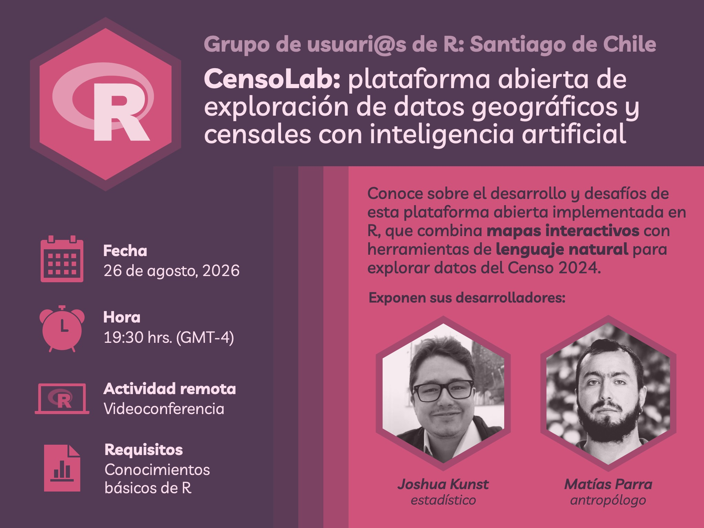
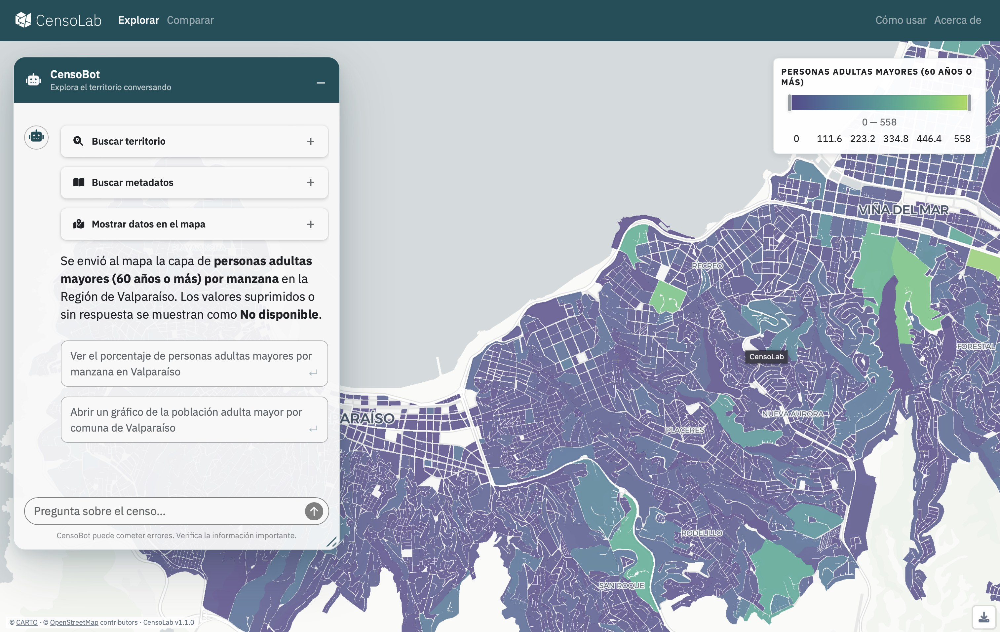
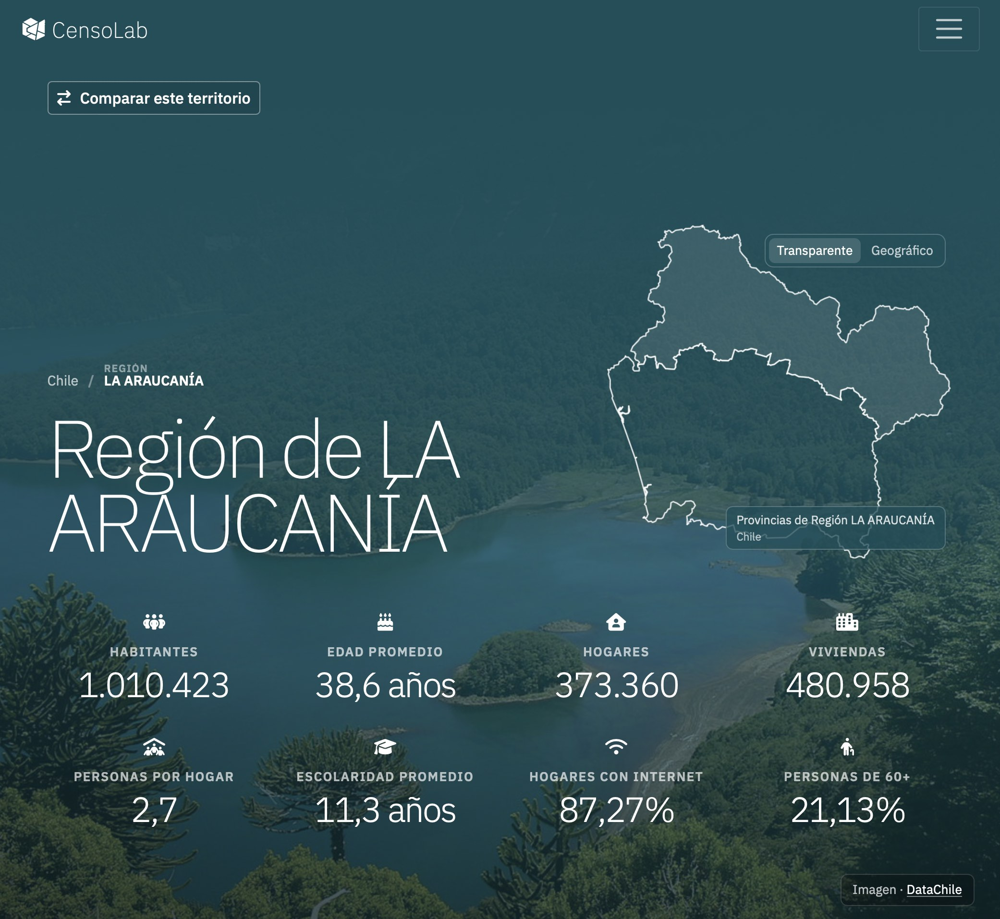
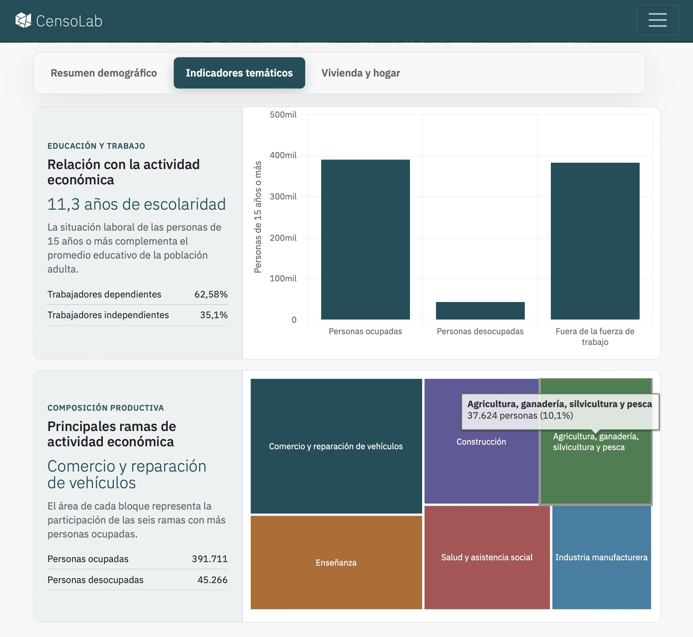
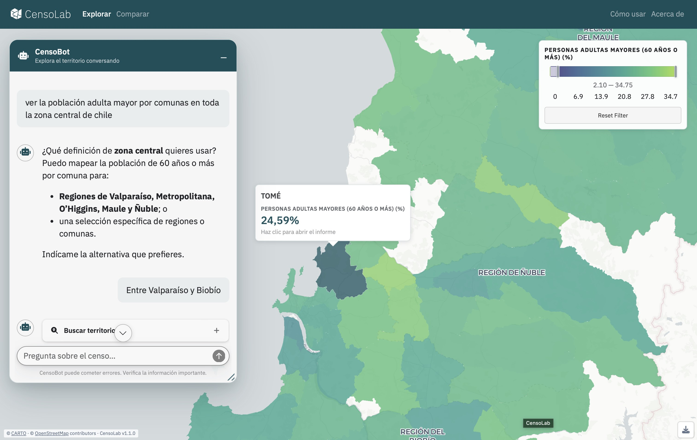
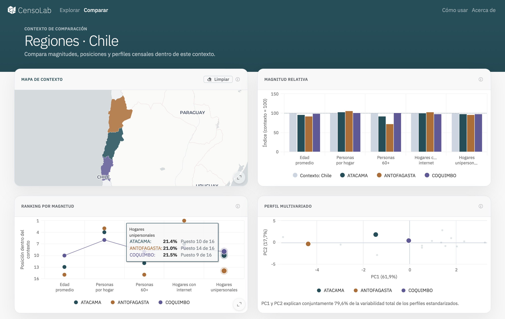

Este mes de Agosto tenemos la presentación y taller de [**CensoLab**](http://censolab.cl), una plataforma interactiva desarrollada en R que permite explorar información geográfica del Censo por medio de mapas interactivos, un dashboard, y lenguaje natural mediante inteligencia artificial.

Los autores de **CensoLab**, [Joshua Kunst](https://www.linkedin.com/in/joshuakunst/) (estadístico y _Risk Specialist_) y [Matías Parra](https://www.linkedin.com/in/matias-parra-rojas) (antropólogo y programador), presentarán la plataforma comentando su arquitectura, implementación y los desafíos que enfrentaron, usando ejemplos prácticos sobre los paquetes de R [Shiny](https://shiny.posit.co) y [`{ellmer}`.](https://ellmer.tidyverse.org)

Además compartirán desafíos y decisiones que enfrentaron al desarrollar la plataforma, y explicarán el funcionamiento de la app en un formato de **taller**.

::: {.galeria}
{.fotito .lightbox group="galeria"}
{.fotito .lightbox group="galeria"}
{.fotito .lightbox group="galeria"}
{.fotito .lightbox group="galeria"}
{.fotito .lightbox group="galeria"}
:::

La plataforma combina _dashboards_, visores de mapas, y una interfaz de _chatbot_ de inteligencia artificial que te permite interactuar con el visor de mapas y otros elementos de la plataforma.

Puedes ver una presentación de la plataforma aquí:

::: {.center}
<iframe src="https://www.linkedin.com/embed/feed/update/urn:li:ugcPost:7492655335128821760?compact=1" height="400" width="504" frameborder="0" allowfullscreen="" title="Publicación integrada"></iframe>
:::

## Diapositivas

A continuación dejamos las diapositivas del taller, que incluyen código para aprender a crear herramientas para IA con R, y luego integrarlas en aplicaciones Shiny:

<iframe width="100%" height="420" style="border-radius:6px;"
title="Diapositivas" frameborder="0"
src="https://censolab.cl/slides/202608-taller-usuarios-R/#/title-slide"></iframe>

_Usa las flechas de tu teclado para cambiar las diapositivas_

## Grabación del taller

Más información sobre los [contenidos del taller en esta publicación.](/posts/2026-08-26/)

<iframe width="100%" height="420" src="https://www.youtube.com/embed/tcXRM5oyybw?si=HePUDy2e2U_rC5Zt" title="YouTube video player" frameborder="0" allow="accelerometer; autoplay; clipboard-write; encrypted-media; gyroscope; picture-in-picture; web-share" referrerpolicy="strict-origin-when-cross-origin" allowfullscreen></iframe>

<!---
¡Lxs dejamos cordialmente invitados a esta nueva reunión de _R Users Santiago_! 
--->

<!---
 Antes de la reunión, asegúrate de tener:

* **R** y **RStudio** instalados ([ver instrucciones aquí](https://bastianolea.github.io/aprende_r/#obtener-r))
* El paquete de R **Quarto** instalado: `install.packages("quarto")`
* **Git** instalado ([ver instrucciones aquí](https://git-scm.com))
* Una cuenta de **GitHub** creada, ya que la utilizaremos para publicar nuestra página web!
--->

<!---
¡Nos vemos el miércoles 26 de agosto! 

### Taller de agosto:
- **26 de agosto de 2026, 19:30 hrs.** (Santiago), online

:::{.boton}
<a href = "https://us06web.zoom.us/j/87107671788?pwd=4kPLbSr4ZaWc1HX1XfbMeOWIkrVWah.1" target = "_blank">
 Conéctate por Zoom
</a>
:::
--->

<!-- botón de google calendar --->
<!---
:::{.boton}
<a href = "https://calendar.app.google/NTxLqdsF71ixHKq59" 
target = "_blank">

 Agregar a Google Calendar

</a>
:::
--->

<!-- botón de descargar calendario --->
<!---
:::{.boton}
<a href="evento_r_chile.ics" 
download="evento_r_chile.ics">

 Descargar para Calendario

</a>
:::

Nos puedes ayudar difundiendo el aviso de la reunión [en LinkedIn ](https://www.linkedin.com/company/santiagorusers) y en [Twitter/X ](https://x.com/SantiagoRusers/)
--->

<!---
----

Por mientras, puedes unirte al **chat grupal** para conversar y ayudar a coordinar la reunión!

  <a href = "https://join.slack.com/t/santiagorusers/shared_invite/zt-3tzmsdyat-gNAUz5mjPij0xFgNLtXeKA" 
  style="text-decoration: none; color: #FDF4F8;" target = "_blank">
  
   Únete al chat grupal en Slack
    
  </a>

--->

<!---
::: {style="margin-top: 42px;"}

:::
--->

<!---
_Recuerda que al participar en las reuniones de la comunidad de usuarias y usuarios de R, estás aceptando el [código de conducta](https://ropensci.org/es/código-de-conducta/), que busca asegurar un espacio seguro e inclusivo para todas las personas._
--->